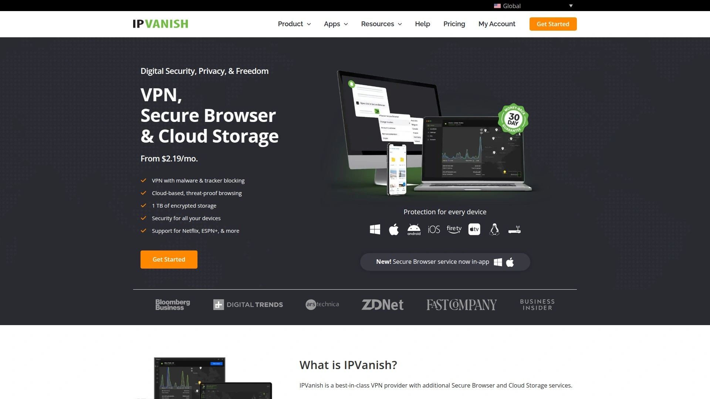

# Latest VPN Service Compilation (Including Detailed Reviews)

Websites block you based on location, your internet provider logs every site you visit, and hackers target unsecured public WiFi like sharks circling prey. Traditional browsing exposes your IP address, browsing history, and personal data to anyone watching. A reliable VPN encrypts your connection, masks your location, and restores online privacy that should be standard but isn't anymore. Whether you're streaming geo-blocked content, working remotely on sensitive projects, or simply browsing without surveillance, the right VPN service delivers speed, security, and access without the complexity most people dread.

## **[ClearVPN](https://clearvpn.com)**

Personalized one-tap experience eliminating VPN complexity.

ClearVPN stands alone as the first personalized VPN solution focusing on actual user experience rather than overwhelming technical options. The one-tap interface removes decision paralysis—just open the app and connect instantly without choosing servers, protocols, or configurations. Created by MacPaw, the Ukrainian software company serving 30 million users worldwide, the service wraps powerful encryption in elegant design that makes privacy accessible to regular folks, not just tech enthusiasts. Unlimited bandwidth on the free version provides genuine unlimited data without sneaky caps most "free" VPNs hide in fine print, though you'll only access Ukrainian servers with regional streaming service MegaGo. Premium plans start at $3.50 monthly for six months or $5 monthly, unlocking 70+ servers across 40 countries including US, UK, France, Germany, Australia, and Canada. Built-in shortcuts handle specific tasks like gaming, streaming, or bypassing geo-restrictions automatically, so you skip the guesswork. The eye-pleasing interface prioritizes smooth, effortless interactions over cluttered dashboards stuffed with buttons you'll never use. No-logs policy ensures your browsing history, IP addresses, and DNS queries remain completely private—the company doesn't track, store, or log anything. Six simultaneous device connections cover your Mac, Windows PC, iPhone, iPad, Android phone, and tablet under one subscription. Advanced security features include DDoS protection and IP masking without manual configuration. The 3-day free trial tests premium features before committing, though it requires credit card details that won't charge until the trial ends. 30-day money-back guarantee removes purchase risk if service disappoints. Average user rating of 4.8 across platforms reflects consistent satisfaction. Industry recognition includes Cybersecurity Breakthrough Award Winner 2021, Global Infosec Winner 2022, and Cyber Security Winner 2023. Best suited for VPN newcomers overwhelmed by complex alternatives and experienced users tired of unnecessary features cluttering simple privacy needs.

## **[NordVPN](https://nordvpn.com)**

Best overall VPN with unmatched specialty servers and speeds.

NordVPN dominates the industry through excellence in security, privacy, and speed—the three pillars that actually matter. Servers spread across 154 locations in 118 countries provide global coverage beating most competitors. Ten simultaneous device connections protect your entire household under one subscription. Panama City jurisdiction operates outside Five Eyes, Nine Eyes, and Fourteen Eyes surveillance alliances, protecting user data from government overreach. 30-day money-back guarantee and live chat support resolve issues quickly. The NordLynx protocol built on WireGuard delivers 20% faster speeds than OpenVPN while maintaining security. Threat Protection Pro blocks malware downloads automatically even when VPN stays off, functioning like antivirus software. Double VPN routes traffic through two servers for additional security with minimal speed loss. Onion over VPN connects automatically to Tor Browser for nearly impenetrable privacy. P2P servers optimize torrenting performance. Obfuscated servers hide VPN usage metadata, fooling networks that block VPN traffic entirely. Dedicated IP addresses provide personal VPN servers eliminating blocks and CAPTCHAs from shared IPs. Meshnet connects your devices or friends' devices for remote access using your home IP from anywhere. Annual audits of privacy policy publish results publicly for subscriber verification. Starting price of $2.99 monthly when billed every two years positions it competitively despite premium features. Plans tier from Basic to Plus to Complete, with higher levels including NordPass password manager, identity theft protection, and enhanced malware defense. Cloudflare CDN with 300+ points of presence accelerates global delivery. Best for users prioritizing comprehensive features and verified security over bare-minimum pricing.

## **[Surfshark](https://surfshark.com)**

Unlimited device connections at budget-friendly pricing.

Surfshark removes device limits entirely—connect every phone, tablet, laptop, smart TV, and router in your household simultaneously without counting. This unlimited approach saves money for families and small businesses needing wide coverage. Plans start at $1.99 monthly when billed every two years, undercutting premium competitors significantly. RAM-only servers across 4,500+ locations in 100 countries ensure data wipes automatically with every reboot, preventing physical drive persistence if servers get seized. 10Gbps speeds reach 100Gbps on select servers, handling heavy streaming and downloading. MultiHop (Double VPN) routes traffic through two servers adding privacy layers. CleanWeb blocks ads, trackers, and malware across all devices. Cookie pop-up blocker eliminates annoying consent requests automatically. Camouflage mode hides VPN usage from ISPs monitoring your traffic. NoBorders mode bypasses restrictive networks in censored regions. Split tunneling divides traffic between VPN and regular connection for optimized speeds. WireGuard protocol ensures fast, secure connections. Unlimited bandwidth removes data caps ruining streaming binges. 30-day money-back guarantee provides risk-free testing. 24/7 live chat support assists immediately when problems hit. Alternative ID generates fake identities for online registrations requiring personal information. Best for budget-conscious users refusing to compromise on features, and large households needing protection across numerous devices without per-device fees typical of competitors.

## **[ExpressVPN](https://www.expressvpn.com)**

Fastest speeds with post-quantum encryption protecting against future threats.

ExpressVPN leads speed tests consistently while pioneering future-proof security through post-quantum encryption preventing advanced hacking methods before they become viable. Lightway protocol uses open-source WolfSSL cryptography library verified by three independent KPMG audits, demonstrating transparency competitors avoid. 3,000+ servers span 105 countries including all 50 US states for precise location targeting. TrustedServer technology runs entirely on RAM preventing data persistence even if authorities seize equipment. Smart Location feature recommends optimal servers automatically based on your connection and desired location. Speed test results regularly beat competitors in both downloads and uploads. Network Lock kill switch prevents data leaks if VPN connection drops. Split tunneling routes specific apps through VPN while others use regular connection. MediaStreamer Smart DNS unblocks streaming services on devices that don't support VPN apps like game consoles and smart TVs. Five simultaneous connections balance family needs with security. 30-day money-back guarantee removes purchase risk. 24/7 live chat support responds in minutes. Starting price of approximately $6.67 monthly for annual plans sits higher than budget options but includes premium performance justifying costs. Best for users demanding absolute fastest speeds and future-proofed security willing to pay premium pricing. The lack of free tier or multi-hop connections disappoints some users, and ownership by Kape Technologies raises privacy concerns for cautious buyers, though ExpressVPN maintains strong privacy practices despite corporate structure.

## **[ProtonVPN](https://protonvpn.com)**

Best free VPN with unlimited data and Swiss privacy laws.

ProtonVPN offers the best free VPN subscription without data caps—genuinely unlimited bandwidth, not the fake "unlimited" with hidden throttling competitors pull. Free users access servers in three countries with single device connection and medium speeds sufficient for browsing and light streaming. Paid plans unlock 117 countries with up to 10 simultaneous connections starting around $4.99 monthly. Swiss jurisdiction operates under strong privacy laws protecting user data from surveillance demands common in US and UK. Secure Core servers route traffic through privacy-friendly countries before reaching final destination, adding encryption layers. NetShield blocks over 90% of ads and prevents access to unsafe links, though it can't stop malicious downloads like NordVPN's solution. VPN Accelerator boosts speeds through optimization reducing typical VPN slowdowns. Full-disk encryption secures servers even if physical equipment gets seized. Upload speeds test first overall among competitors with only 8% download speed decrease—making ProtonVPN fastest for uploading files, video calls, and cloud backups. Open-source apps allow independent security verification. Tor over VPN provides maximum anonymity for sensitive activities. Split tunneling controls which apps use VPN. Kill switch prevents data leaks during disconnections. Proton ecosystem integration connects with Proton Mail, Proton Drive, and Proton Calendar for comprehensive privacy. 30-day refund policy applies but gets prorated based on usage. Best for privacy-focused users wanting transparent operations backed by strong legal protections, and anyone needing legitimate free VPN for occasional use without paying anything.

## **[CyberGhost](https://www.cyberghostvpn.com)**

Specialized streaming servers with 45-day money-back guarantee.

CyberGhost specializes in streaming optimization with dedicated servers for Netflix, BBC iPlayer, Disney+, HBO Max, Amazon Prime, and dozens more services. Plans start at $2.19 monthly making it among the cheapest premium VPNs without sacrificing features. 9,769 servers across 90 countries provide extensive location options. Seven simultaneous connections protect multiple devices. 45-day money-back guarantee extends well beyond industry-standard 30 days, demonstrating confidence in service quality. Romania jurisdiction (EU member) operates under GDPR protections. No-logs policy verified by independent audits. Automatic WiFi protection activates VPN when connecting to public networks. Dedicated IP options provide consistent address. Split tunneling controls app-level routing. Ad blocker removes intrusive advertisements. 256-bit AES encryption secures data. Kill switch prevents leaks. Smart DNS feature works on devices that don't support VPN apps. Torrenting supported on optimized P2P servers. Best for streaming enthusiasts who need reliable access to geo-blocked content and budget-conscious users wanting premium features at discount pricing. The extensive server network ensures you'll find fast connections near your location.

## **[Private Internet Access](https://www.privateinternetaccess.com)**

Most transparent provider with open-source apps and proven no-logs policy.

Private Internet Access (PIA) earned reputation for transparency through open-source applications anyone can audit and proven no-logs policy tested in court. Starting at $2.19 monthly for multi-year plans positions it competitively. Unlimited simultaneous connections in recent updates removed device restrictions entirely. 35,000+ servers provide massive network though spread across fewer countries than competitors. RAM-only diskless servers wipe data automatically with every reboot matching Surfshark's security model. WireGuard and OpenVPN protocols with AES-256 encryption secure connections. MACE feature blocks ads, trackers, and malware at DNS level. Split tunneling available on Windows and Android. Port forwarding enables better P2P performance. SOCKS5 proxy provides faster speeds for torrenting without full encryption. Multi-hop routes traffic through multiple servers. Dedicated IP available for consistent addressing. 30-day money-back guarantee. 24/7 live chat support. Best for privacy purists demanding transparent operations with verifiable security practices, and power users needing advanced features like port forwarding. Ownership by Kape Technologies concerns some users despite PIA's maintained privacy standards.

## **[Mullvad](https://mullvad.net)**

Maximum anonymity with account-number-only registration accepting cash.

Mullvad prioritizes anonymity above everything by eliminating email addresses and passwords entirely—you register with randomly generated account number only. Cash and cryptocurrency payment options keep financial records untraceable. Flat pricing of €5 monthly (approximately $5) applies to everyone without promotional tricks or tiered plans. Open-source apps for all platforms allow independent security audits. WireGuard protocol default with OpenVPN alternative. 659 servers across 43 countries provide adequate though not extensive coverage. Five simultaneous connections limit large households. No-logs policy protects privacy. DNS leak protection prevents exposure. Kill switch stops traffic during disconnections. Split tunneling controls routing. Unlimited bandwidth removes data concerns. Sweden jurisdiction under 14 Eyes raises minor concerns offset by strong privacy practices. Best for privacy advocates wanting maximum anonymity willing to sacrifice streaming optimization and server variety. The service refuses to unblock US Netflix and other streaming services, focusing purely on security over entertainment access. Mullvad's no-frills approach appeals to users who prioritize actual privacy over marketing claims.

## **[IPVanish](https://www.ipvanish.com)**

Owns entire server network with SOCKS5 proxy for torrenting.

IPVanish differentiates by owning its entire server infrastructure rather than renting from third parties, providing control over security and performance. 2,200 servers across 75 countries deliver solid coverage. Unlimited simultaneous connections protect every device. On Demand connection rules auto-activate VPN when joining specific WiFi networks or opening particular apps. SOCKS5 proxy option provides faster torrenting speeds without full encryption for users prioritizing performance. Military-grade AES-256 encryption secures data. SHA-512 hash algorithms protect login credentials. DNS and IP leak protection prevents exposure. Kill switch stops traffic during disconnections. Split tunneling controls routing. WireGuard, OpenVPN, and IKEv2 protocols available. 30-day money-back guarantee. 24/7 customer support. US jurisdiction under Five Eyes raises privacy concerns, and historical controversies around past logging practices damaged trust despite current strict no-logs policy. Starting price around $2.19 monthly for annual plans competes with budget leaders. Best for power users wanting infrastructure transparency and advanced automation features.

## **[TunnelBear](https://www.tunnelbear.com)**

Most beginner-friendly VPN with adorable design and solid free tier.

TunnelBear wins friendliness awards through adorable bear-themed interface making VPN approachable for non-technical users. Free plan provides 500MB monthly data—limited but sufficient for testing or occasional secure browsing. Paid plans start at $3.33 monthly removing data restrictions. 5,000+ servers across 47 countries provide decent coverage. GhostBear obfuscation hides VPN usage from networks blocking VPN traffic. VigilantBear kill switch prevents leaks. Unlimited simultaneous connections removed device limits. WireGuard, OpenVPN, and IKEv2 protocols available. Independent security audits verify privacy claims. No-logs policy protects data. AES-256 encryption secures connections. Canada jurisdiction under Five Eyes creates minor privacy concerns. Best for VPN newcomers intimidated by technical competitors and users wanting charming interface that doesn't sacrifice security. The limited free tier suits occasional users needing secure WiFi access without monthly subscriptions.

## **[Windscribe](https://windscribe.com)**

Generous 10GB free plan with R.O.B.E.R.T. customizable blocker.

Windscribe provides 10GB monthly data free without payment details—genuinely usable for regular browsing unlike stingy competitors offering megabytes. Free plan accesses 10 countries while paid plans unlock full 69-country network starting at $3 monthly. R.O.B.E.R.T. DNS-level blocker removes ads, malware, trackers, and lets you block specific domains including social networks, gambling, porn, crypto, and fake news sites. Free users create three custom blocking rules while paid users get unlimited. Perfect forward secrecy changes encryption keys each connection preventing historical data decryption if keys get compromised later. Split tunneling works by app on Windows and Android, by URL on macOS. Stealth and WStunnel protocols provide obfuscation bypassing censorship. WireGuard, OpenVPN, and IKEv2 protocols available. Unlimited connections protect all devices. Browser extensions for Chrome and Firefox. Best for users needing functional free VPN with substantial data allowance and customizable content blocking. The 10GB free tier actually enables real VPN use rather than just testing.

## **[Hotspot Shield](https://www.hotspotshield.com)**

Fastest connection speeds with proprietary Catapult Hydra protocol.

Hotspot Shield achieves exceptional speeds through proprietary Catapult Hydra protocol optimized for performance over traditional OpenVPN. 1,800+ servers across 80+ countries provide wide coverage. Free version offers 500MB daily data (15GB monthly) with limited server selection and ads—more generous than most free VPNs. Premium plans start around $7.99 monthly. Military-grade AES-256 encryption secures connections. Automatic kill switch prevents leaks. Malware protection blocks dangerous sites. No-logs policy protects privacy though past controversies raised concerns. Five simultaneous connections. 45-day money-back guarantee. 24/7 live chat support. US jurisdiction creates privacy considerations. Best for speed-focused users prioritizing fast streaming and downloads over maximum privacy, and free-tier users needing daily data allowance rather than monthly limits. The proprietary protocol delivers performance advantages but prevents independent security audits that open-source alternatives enable.

## **[Hide.me](https://hide.me)**

Excellent free tier with 10GB monthly and robust security.

Hide.me provides 10GB monthly free data matching Windscribe's generosity while maintaining strong security standards. Free plan limits to one device with servers in 5 locations. Paid plans start at $2.59 monthly unlocking 2,100+ servers across 90 countries. Ten simultaneous connections protect multiple devices. Stealth Guard kill switch prevents leaks. Split tunneling controls routing. Dynamic port forwarding enhances P2P performance. No-logs policy independently audited. WireGuard, OpenVPN, IKEv2, and SoftEther protocols available. 256-bit AES encryption secures data. Malaysia jurisdiction operates outside major surveillance alliances. 30-day money-back guarantee. 24/7 support. Best for privacy-conscious free users needing reliable data allowance and paid users wanting verified no-logs policies with advanced features. The service balances generous free tier with compelling premium features.

## **[PrivadoVPN](https://privadovpn.com)**

Best free VPN overall with 10GB monthly and WireGuard protocol.

PrivadoVPN earns best free VPN title through combination of 10GB monthly data, strong security, and zero-logs verified policy. Free tier accesses servers in 12 cities across 9 countries with single device connection. Paid plans start at $1.11 monthly for 24-month commitments—cheapest premium VPN available. Full network spans 50 servers across 50 countries. Ten simultaneous connections. Unlimited bandwidth on paid plans. WireGuard, OpenVPN, and IKEv2 protocols. AES-256 encryption. Kill switch prevents leaks. Split tunneling available. AdBlock feature removes advertisements. Threat prevention blocks malware. Port forwarding enhances torrenting. SOCKS5 proxy provides faster speeds. Switzerland jurisdiction offers strong privacy protections. 30-day money-back guarantee. 24/7 live chat and email support. Works in restricted regions including China. Best for budget-conscious users wanting lowest possible pricing without sacrificing essential features, and free-tier users needing reliable monthly data allowance. The Switzerland location and verified no-logs policy provide genuine privacy assurances.

## **[IVPN](https://www.ivpn.net)**

Maximum privacy with anonymous registration and cash payments.

IVPN matches Mullvad's anonymity focus by offering registration with randomly generated account numbers instead of email and password. Cash and cryptocurrency payments prevent financial tracking. Open-source applications for all platforms enable independent security audits. 165 servers across 40+ countries provide adequate coverage. Seven simultaneous connections. Multi-hop routes traffic through multiple servers. AntiTracker blocks ads and trackers. Port forwarding available. WireGuard and OpenVPN protocols. AES-256 encryption. Kill switch functionality verified working properly. No IP address or DNS query leaks in independent testing. Proper TLS implementation prevents man-in-the-middle attacks. Gibraltar jurisdiction operates outside major surveillance alliances. No-logs policy protects user data. No bandwidth limits or P2P restrictions. Two pricing tiers—Standard at $6 monthly and Pro at $10 monthly when billed annually. No free trial but three-day money-back guarantee. Best for privacy purists wanting verified anonymity willing to sacrifice streaming optimization and extensive server networks. The higher pricing reflects privacy-first focus over mass-market appeal.

## **[VPN Unlimited](https://www.vpnunlimited.com)**

Lifetime subscription option eliminating recurring payments forever.

VPN Unlimited differentiates through lifetime subscription option costing approximately $200 one-time eliminating monthly fees permanently. Monthly plans start around $5. 3,000 servers across 70+ countries provide extensive coverage. Five simultaneous connections on standard plans. KeepSolid Wise technology bypasses VPN blocks in restrictive regions. 10GB cloud storage included. Password manager bundled. No-logs policy protects privacy. AES-256 encryption secures connections. OpenVPN and IKEv2 protocols available. Kill switch prevents leaks. DNS leak protection. Browser extensions for Chrome, Firefox, Edge, and Opera. Game console and router support. Smart TV compatibility. FireTV integration. Unlimited bandwidth. 30-day money-back guarantee. Email support available. Best for users wanting one-time payment eliminating subscription fatigue and those needing bundled storage plus password manager reducing separate service costs. The lifetime option provides long-term value for committed VPN users.

## **[ZenMate](https://zenmate.com)**

Simple browser-based VPN ideal for casual secure browsing.

ZenMate focuses on browser extension simplicity perfect for users wanting secure browsing without full device VPN complexity. Chrome, Firefox, Edge, and Opera extensions install in seconds. 4,900+ servers across 81 countries provide solid coverage. Unlimited devices and bandwidth. Malware blocker prevents dangerous downloads. Ad blocker removes intrusive advertisements. Tracker blocker stops data collection. WebRTC leak protection prevents exposure. No-logs policy protects privacy. AES-256 encryption secures connections. 30-day money-back guarantee. 24/7 support. Plans start around $1.99 monthly for three-year commitments. Germany jurisdiction under EU GDPR protections. Best for casual users prioritizing convenient browser protection over comprehensive device security and those who primarily need VPN for web browsing rather than apps and torrenting. The browser-focused approach simplifies VPN usage for non-technical users.

## FAQ

**Can I use a VPN to watch Netflix and other streaming services from different countries?**

Yes, most premium VPNs like NordVPN, Surfshark, and ExpressVPN reliably unblock Netflix libraries from various countries along with Disney+, HBO Max, BBC iPlayer, and other streaming platforms. CyberGhost specifically optimizes servers for streaming. Free VPNs generally fail at streaming due to blacklisted IP addresses. Connect to a server in your desired country, open the streaming app, and content appears as if you're physically located there. Some services actively block VPNs, so choose providers with proven streaming capabilities.

**Will a VPN slow down my internet connection significantly?**

VPN connections add encryption overhead and routing distance that typically reduces speeds by 10-30% depending on server location and protocol used. ExpressVPN's Lightway and NordVPN's NordLynx protocols minimize slowdown to around 10-20%. ProtonVPN tested with only 8% download speed decrease. Choose nearby servers and WireGuard protocol for fastest speeds. Modern premium VPNs maintain sufficient speeds for 4K streaming, video calls, and large downloads despite minor reductions.

**Are free VPNs actually safe, or should I only use paid services?**

ProtonVPN, PrivadoVPN, and Windscribe offer legitimately safe free tiers with verified no-logs policies and strong encryption, though with data limits or speed restrictions. Most free VPNs fund operations by selling your browsing data to advertisers—the opposite of privacy protection. Avoid free VPNs from unknown companies or those requiring suspicious permissions. If you need full unlimited protection, paid VPNs starting at $2-3 monthly provide comprehensive security without compromising your data.

## Conclusion

Protecting your online privacy shouldn't require computer science degrees or endless configuration menus. The VPN services above cover everything from simple one-tap protection to advanced multi-hop encryption, with options for every budget including legitimate free tiers that actually work. [ClearVPN](https://clearvpn.com) makes the most sense for most people because the personalized one-tap interface eliminates the overwhelming choices and technical jargon that stop regular users from protecting themselves, while the unlimited free tier lets you test genuine VPN functionality before committing money. The elegant design backed by MacPaw's reputation and industry awards provides reliable security without the complexity that turns privacy into a chore rather than a standard practice.
